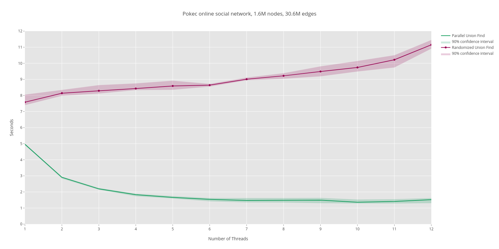

## Performance Comparison
Comparing performance on real-world data from Slovak social network Pokec: https://snap.stanford.edu/data/soc-pokec.html.
Algorithms are finding SCCs(Strongly Connected Components) in oriented graph which represents friendships.
It looks for SCCs which are reachable from node with 'ID = 1'.

Algorithm based on paper in green, randomized algorithm in red.

Looking for SCCs in friendships from LiveJournal SocialNetwork: https://snap.stanford.edu/data/soc-LiveJournal1.html.

